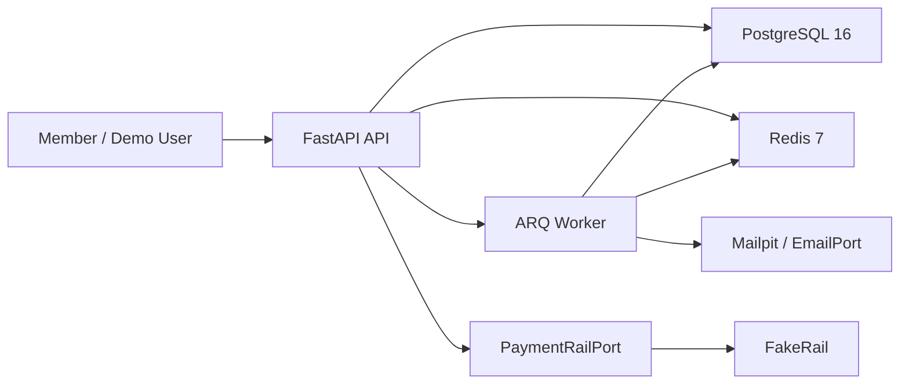
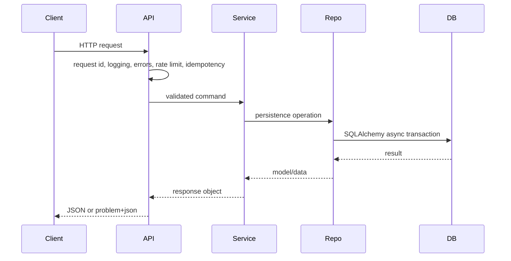

# Architecture

Àjọ is a monolith-first FastAPI backend for a digital esusu showcase. The code is
structured so future modules can be added without crossing ownership boundaries.

## Context

## Module Map

- `app/core` - config, errors, logging, security, idempotency, pagination, deps.
- `app/db` - engine/session/base plus database-level ledger primitives.
- `app/modules/identity` - implemented in this pass; member onboarding and auth.
- `app/modules/circles` - skeleton only; copyable module template.
- `app/modules/ledger` - service boundary over `app/db/ledger.py`.
- `app/modules/payments` - rail port, `FakeRail`, webhook and reconciliation core.
- `app/modules/screening` - screening port and fake implementation.
- `app/modules/notifications` - email port and local/demo implementations.
- `app/workers` - ARQ settings, job registry, cron registry.

## Dependency Rule

Routers call services. Services call repos and other modules' services. Repos own
database persistence for their module. Cross-module imports bypassing another
module's `service.py` are forbidden and enforced with import-linter.

## Request Flow

## Jobs and Transactions

Jobs are enqueued after the database transaction commits. Services collect
pending jobs in transaction context; the session commit hook flushes them to ARQ
only after durable state exists. This prevents workers from observing events for
rows that later roll back.

The implementation lands in the jobs pass.

