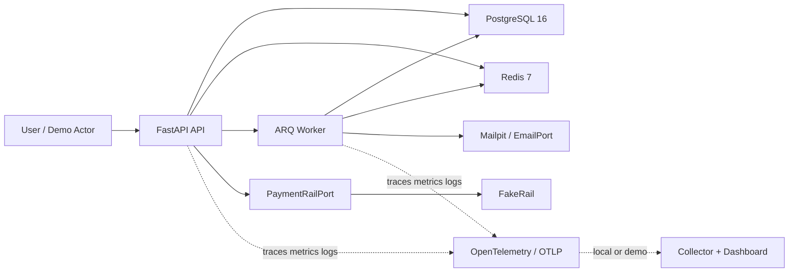
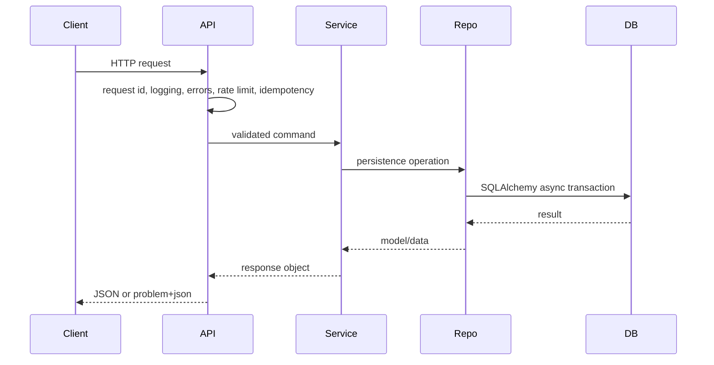

# Architecture

Àjọ is a monolith-first FastAPI backend for a digital esusu showcase. The code is
structured so future modules can be added without crossing ownership boundaries.

## Context

## Module Map

- `app/core` - config, errors, logging, security, idempotency, pagination, deps.
- `app/db` - engine/session/base plus database-level ledger primitives.
- `app/modules/identity` - implemented in this pass; user authentication.
- `app/modules/members` - domain member profile, verification state surface, and
  user-to-member ownership.
- `app/modules/wallets` - member wallet ownership, wallet ledger account
  provisioning, balance/activity reads, top-ups, withdrawals, and statements.
- `app/modules/circles` - M2 circle lifecycle: create, invite, agreement, lock,
  commit-reveal draw, schedule generation, FakeRail collection, payout,
  late-failure, arrears, shortfall, ledger, statement, and completion.
- `app/modules/ledger` - service boundary over `app/db/ledger.py`.
- `app/modules/payments` - rail port, `FakeRail`, webhook and reconciliation core.
- `app/modules/screening` - screening port and fake implementation.
- `app/modules/notifications` - email port and local/demo implementations.
- `app/workers` - ARQ settings, job registry, cron registry.

## Dependency Rule

Routers call services. Services call repos and other modules' services. Repos own
database persistence for their module. Cross-module imports bypassing another
module's `service.py` are forbidden and enforced with import-linter.

`pyproject.toml` defines one import-linter contract per business module. The
contracts forbid direct imports of another module's repos, models, routers,
schemas, ports, provider fakes, and types. Explicit exceptions are limited to
accepted service-boundary calls, such as identity invoking screening through
`app.modules.screening.service`.

## Request Flow

## Errors and Request Logging

`app/core/middleware.py` creates or accepts `X-Request-ID`, binds it into a
context variable, returns it on the response, and emits one structured log event
per request. `app/core/errors.py` translates application, HTTP, validation, and
unhandled exceptions into RFC 9457 `application/problem+json` responses.

Unhandled errors return opaque 500 responses with `trace_id`; stack details stay
in logs only.

## Observability

The showcase observability target is one OpenTelemetry setup that can emit the
three useful signals from the API and worker: traces, metrics, and structured
logs. The application should export through OTLP when configured, so the local
or demo backend can be swapped between a collector, Jaeger, Prometheus/Grafana,
Tempo/Loki, or a vendor without changing business code.

This is deliberately phased:

- M1 adds the minimal foundation: FastAPI request tracing, trace-correlated
  structured logs, a small set of wallet/payment/ledger spans, and one metric
  proving a wallet top-up can be followed end to end.
- M6 turns the foundation into a pitch artifact: a local or demo collector and
  dashboard that shows a money flow crossing HTTP, service logic, payment rail,
  ledger posting, jobs, and database work.

M1 OpenTelemetry is controlled by environment:

- `OTEL_ENABLED` defaults to `true`.
- `OTEL_SERVICE_NAME` defaults to `ajo-backend`.
- `OTEL_EXPORTER_OTLP_ENDPOINT` enables OTLP HTTP export when set, for example
  `http://otel-collector:4318`.

When no OTLP endpoint is configured, FastAPI instrumentation and business spans
still run against the no-op SDK provider, so local development does not require a
collector. A local collector/dashboard stack is intentionally deferred to M6; the
intended path is OTLP HTTP into an OpenTelemetry Collector, then traces/metrics
to Jaeger, Tempo/Prometheus/Grafana, or a demo vendor.

Business-level spans should be added around money and state-transition seams:

- wallet top-up and withdrawal orchestration.
- `PaymentRailPort` calls.
- `post_entry()` and ledger replay checks.
- webhook persist/process.
- reconciliation jobs.
- ARQ jobs and crons.
- circle collection, payout, late-failure, shortfall, and arrears handling.

Business-level metrics should answer operational questions rather than mirror
every internal function:

- request count and latency by route.
- job success/failure and duration.
- ledger postings created and rejected.
- idempotency replays and concurrent conflicts.
- payment state transitions, late failures, and reconciliation breaks.
- circle collections due, collected, failed, and paid out.

Logs should remain structured and include correlation fields where available:
`request_id`, OpenTelemetry trace/span IDs, `user_id`, `member_id`, `circle_id`,
`payment_object_id`, `journal_entry_id`, `provider`, and `idempotency_key`.

## Rate Limiting and Idempotency

`app/core/rate_limit.py` implements Redis fixed-window limits. Auth routes are
limited to 5 requests per minute per client IP; authenticated write flows use 60
requests per minute per user. Redis failures fail open with loud structured
logging because availability should not depend on a defensive throttle.

`app/core/idempotency.py` requires `Idempotency-Key` on mutating methods. It
checks for a stored response, acquires a Redis lock for in-flight keys, captures
the first response, stores it for 48 hours, and replays subsequent responses from
Redis. Concurrent duplicates return 409 while the first request is still running.

## Health

`/healthz` is a cheap process liveness check. `/readyz` checks Postgres and Redis
with one-second timeouts and returns `503 application/problem+json` when any
dependency is unavailable. Docker Compose and Railway should use `/readyz`.

## Identity and Auth

`app/modules/identity` owns the `User` authentication principal, password hashes,
access-token validation, and refresh-token families. Access JWTs expire after 15
minutes and carry `user_id` plus `token_version`. Refresh tokens are opaque
values; only peppered SHA-256 HMAC hashes are stored.

`User` is only the authentication principal. Product flows do not attach wallet,
circle, screening, or rail state directly to `User`.

`Member` is the domain/person profile for a registered user. A member belongs to
exactly one user and is the stable owner used by wallet, screening, circles, and
future payment rail onboarding. The member model carries person-level profile and
verification state only; it must not contain circle-specific fields such as
circle role, contribution amount, payout position, invite state, arrears, or cycle
status.

Registration calls `ScreeningService` after the `User` row is created and before
tokens are issued. In this pass the default screening port is
`AlwaysClearScreening`; OpenSanctions arrives later behind the same port.

Registration creates the `User`, performs screening through `ScreeningService`,
then ensures a `Member` profile exists for that user before tokens are issued.
Duplicate registration must not create duplicate members.

## Members and Wallets

`app/modules/members` owns the `Member` aggregate. A member is the person-domain
record attached to a user account and is the identity used by wallet, screening,
circles, and future rails. Other modules load member state through
`MembersService`, not by importing member repos or models directly.

A member exposes verification state derived from persisted screening results. In
M1 the default screening provider is `AlwaysClearScreening`, so new members are
expected to become verified immediately in local/demo flows. Later providers may
move a member into review without changing wallet ownership.

`app/modules/wallets` owns the wallet aggregate. A wallet belongs to exactly one
member and is denominated in GBP only. The wallet stores ownership and
provisioning metadata, but wallet balances are not hand-maintained business
truth. Available and pending balances are derived from the member wallet ledger
accounts.

Each wallet has deterministic ledger account codes so provisioning can be
idempotent:

- `member:{member_id}:wallet:pending:gbp`
- `member:{member_id}:wallet:available:gbp`

The platform settlement account is shared across M1 wallet flows:

- `platform:settlement:gbp`

Wallet routes call `WalletService`. Wallet money movement calls `PaymentsService`
for provider-plural rail operations and `LedgerService` for postings. Wallet code
must not call FakeRail directly and must not bypass the ledger write path.

## Circles

`app/modules/circles` owns circle state, membership, invites, agreements, draw,
cycle schedule, contribution obligations, payouts, arrears, and shortfalls.
Routers resolve the current `Member` through `MembersService`; circle services
own circle permission checks and call `LedgerService`/`PaymentsService` for money
movement.

Circle states:

- `draft`
- `recruiting`
- `agreement_pending`
- `locked`
- `draw_pending`
- `active`
- `completed`
- `cancelled`

Valid transitions:

- `draft -> recruiting`
- `recruiting -> agreement_pending`
- `agreement_pending -> locked`
- `locked -> draw_pending`
- `draw_pending -> active`
- `active -> completed`
- any non-terminal pre-completion state may move to `cancelled`

Invalid transitions return `409 application/problem+json`. Locking requires the
target member count and one immutable agreement per active member. Draw reveal is
deterministic: the owner first stores a SHA-256 commitment, then reveals a salt;
the payout order sorts member IDs by `sha256(circle_id:member_id:salt)`.

M2 deliberately stays on `FakeRail`. Third-party payment rails arrive only after
the circle lifecycle can demonstrate collection, payout, late failure, shortfall,
arrears, and reconciliation behavior.

## Screening and Notifications

`app/modules/screening` defines `ScreeningPort.screen_person(name, dob, country)`
and persists every result in `screening_result`. Results are `clear` when no hits
are returned and `review` when the provider returns one or more hits.

`app/modules/notifications` defines `EmailPort`. Current implementations are:

- `ConsoleEmail` for structured-log local output.
- `SmtpEmail` for Mailpit/local SMTP delivery.

Refresh rotation is single-use. If an already-used or revoked refresh token is
presented, the service revokes the whole token family to contain replay.

## Jobs and Transactions

Jobs are enqueued after the database transaction commits. Services collect
pending jobs with `enqueue_after_commit(session, ...)`; `session_scope()` flushes
them to ARQ only after `commit()` succeeds. If the transaction rolls back, queued
jobs are discarded. This prevents workers from observing events for rows that
later roll back.

`app/workers/main.py` owns ARQ worker settings, startup/shutdown hooks, job
logging hooks, and cron registration. `heartbeat` runs as the base cron job.
`max_tries` is 5. `retry_later(job_try)` provides exponential backoff capped at
60 seconds for jobs that need explicit deferral.

Terminal job failures are persisted to `failed_jobs` through the worker
`on_job_end` hook.

## Database and Migrations

SQLAlchemy 2.0 async is the application database API. `app/db/base.py` owns the
declarative base and naming convention so Alembic autogenerate produces stable
constraint names. `app/db/model_registry.py` is the single place future model
modules are imported for metadata discovery.

Alembic runs in async mode against `DATABASE_URL`, falling back to the local URL
in `alembic.ini` when the environment variable is absent. Migration drift is
checked with `make migration-drift`.
