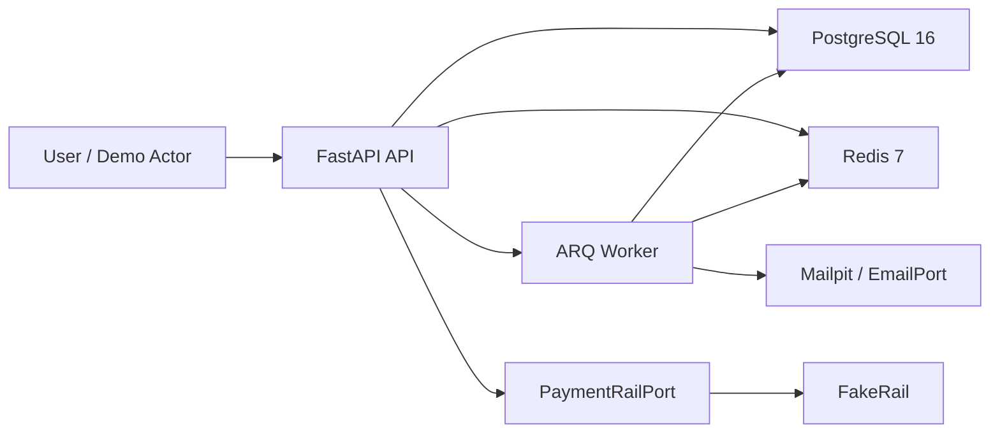
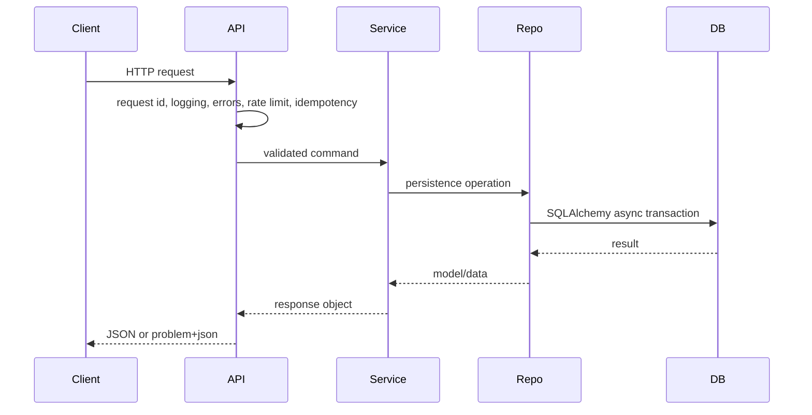

# Architecture

Àjọ is a monolith-first FastAPI backend for a digital esusu showcase. The code is
structured so future modules can be added without crossing ownership boundaries.

## Context

## Module Map

- `app/core` - config, errors, logging, security, idempotency, pagination, deps.
- `app/db` - engine/session/base plus database-level ledger primitives.
- `app/modules/identity` - implemented in this pass; user authentication.
- `app/modules/circles` - skeleton only; copyable module template.
- `app/modules/ledger` - service boundary over `app/db/ledger.py`.
- `app/modules/payments` - rail port, `FakeRail`, webhook and reconciliation core.
- `app/modules/screening` - screening port and fake implementation.
- `app/modules/notifications` - email port and local/demo implementations.
- `app/workers` - ARQ settings, job registry, cron registry.

## Dependency Rule

Routers call services. Services call repos and other modules' services. Repos own
database persistence for their module. Cross-module imports bypassing another
module's `service.py` are forbidden and enforced with import-linter.

## Request Flow

## Errors and Request Logging

`app/core/middleware.py` creates or accepts `X-Request-ID`, binds it into a
context variable, returns it on the response, and emits one structured log event
per request. `app/core/errors.py` translates application, HTTP, validation, and
unhandled exceptions into RFC 9457 `application/problem+json` responses.

Unhandled errors return opaque 500 responses with `trace_id`; stack details stay
in logs only.

## Rate Limiting and Idempotency

`app/core/rate_limit.py` implements Redis fixed-window limits. Auth routes are
limited to 5 requests per minute per client IP; authenticated write flows use 60
requests per minute per user. Redis failures fail open with loud structured
logging because availability should not depend on a defensive throttle.

`app/core/idempotency.py` requires `Idempotency-Key` on mutating methods. It
checks for a stored response, acquires a Redis lock for in-flight keys, captures
the first response, stores it for 48 hours, and replays subsequent responses from
Redis. Concurrent duplicates return 409 while the first request is still running.

## Health

`/healthz` is a cheap process liveness check. `/readyz` checks Postgres and Redis
with one-second timeouts and returns `503 application/problem+json` when any
dependency is unavailable. Docker Compose and Railway should use `/readyz`.

## Identity and Auth

`app/modules/identity` owns the `User` authentication principal, password hashes,
access-token validation, and refresh-token families. Access JWTs expire after 15
minutes and carry `user_id` plus `token_version`. Refresh tokens are opaque
values; only peppered SHA-256 HMAC hashes are stored.

`Member` is intentionally left for the later domain/onboarding model that
participates in circles, screening, and money flows.

Registration calls `ScreeningService` after the `User` row is created and before
tokens are issued. In this pass the default screening port is
`AlwaysClearScreening`; OpenSanctions arrives later behind the same port.

## Screening and Notifications

`app/modules/screening` defines `ScreeningPort.screen_person(name, dob, country)`
and persists every result in `screening_result`. Results are `clear` when no hits
are returned and `review` when the provider returns one or more hits.

`app/modules/notifications` defines `EmailPort`. Current implementations are:

- `ConsoleEmail` for structured-log local output.
- `SmtpEmail` for Mailpit/local SMTP delivery.

Refresh rotation is single-use. If an already-used or revoked refresh token is
presented, the service revokes the whole token family to contain replay.

## Jobs and Transactions

Jobs are enqueued after the database transaction commits. Services collect
pending jobs with `enqueue_after_commit(session, ...)`; `session_scope()` flushes
them to ARQ only after `commit()` succeeds. If the transaction rolls back, queued
jobs are discarded. This prevents workers from observing events for rows that
later roll back.

`app/workers/main.py` owns ARQ worker settings, startup/shutdown hooks, job
logging hooks, and cron registration. `heartbeat` runs as the base cron job.
`max_tries` is 5. `retry_later(job_try)` provides exponential backoff capped at
60 seconds for jobs that need explicit deferral.

Terminal job failures are persisted to `failed_jobs` through the worker
`on_job_end` hook.

## Database and Migrations

SQLAlchemy 2.0 async is the application database API. `app/db/base.py` owns the
declarative base and naming convention so Alembic autogenerate produces stable
constraint names. `app/db/model_registry.py` is the single place future model
modules are imported for metadata discovery.

Alembic runs in async mode against `DATABASE_URL`, falling back to the local URL
in `alembic.ini` when the environment variable is absent. Migration drift is
checked with `make migration-drift`.
