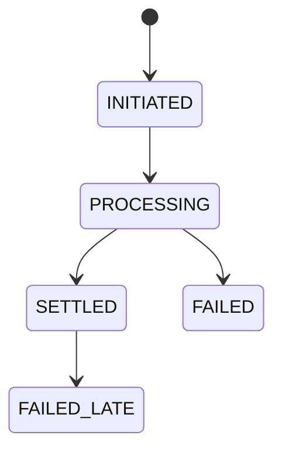

# Payments

Payments are designed around a provider-plural port. This pass implements
`FakeRail` only; Stripe, TrueLayer, GoCardless, and Griffin arrive in later rail
integration passes against the same contract.

## PaymentRailPort

The port covers:

- `onboard_member`
- `create_topup`
- `create_mandate`
- `collect`
- `send_payout`
- `get_settlement_status`
- `verify_webhook`

Rails expose capability flags and answer `rail.supports(Capability.X)`. A rail
may return `NotSupported` for unsupported capabilities. The port is a capability
matrix, not a lowest common denominator.

## Rail Selection

Rail choice is per flow:

- `RAIL_TOPUP`
- `RAIL_COLLECTION`
- `RAIL_PAYOUT`

This supports mixed-rail demos such as TrueLayer pay-ins, GoCardless collections,
and Stripe payouts over one authoritative ledger.

## Settlement State Machine

Unified states:

`FAILED_LATE` is first-class because Bacs-style rails can fail after a previously
reported success. `FakeRail.fail_late()` exists for tests.

## Webhooks

Provider-agnostic pipeline:

1. Verify using the provider strategy.
2. Persist raw event in `partner_event`.
3. Return 200.
4. Process asynchronously.
5. Dedupe by provider event ID.
6. Fetch current provider object state and drive the state machine from that
   state, never from event deltas alone.

Each provider gets a gap-detection cron slot.

## Reconciliation

Nightly reconciliation fetches provider statements or balance transactions,
matches rows to `journal_entry` by idempotency key, writes `recon_break` rows for
unmatched or inconsistent records, then logs at ERROR and sends email when breaks
exist.

`FakeRail` returns its own journal for this skeleton.

## Contract Tests

`tests/contract/test_payment_rail_contract.py` is the headline artifact for rail
interchangeability. It is a single parametrized suite that every future rail must
pass unmodified, asserting lifecycle behavior, idempotency, late-failure
handling, and webhook round-trip.

