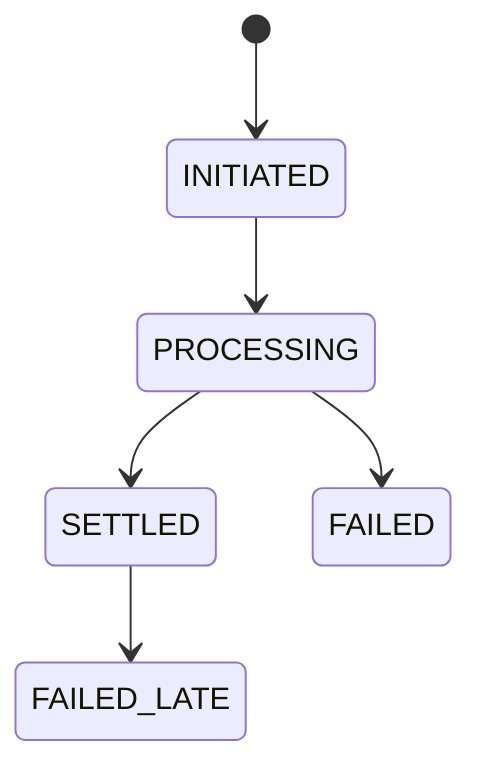

# Payments

Payments are designed around a provider-plural port. The current implementation
includes `FakeRail` for local flows and `StripeRail` for sandbox PaymentIntent
top-ups. TrueLayer, GoCardless, and Griffin arrive in later rail integration
passes against the same contract.

## PaymentRailPort

The port covers:

- `onboard_member`
- `create_topup`
- `create_mandate`
- `collect`
- `send_payout`
- `get_settlement_status`
- `verify_webhook`

Rails expose capability flags and answer `rail.supports(Capability.X)`. A rail
may return `NotSupported` for unsupported capabilities. The port is a capability
matrix, not a lowest common denominator.

Implementation files:

- `app/modules/payments/port.py` - `PaymentRailPort` protocol.
- `app/modules/payments/types.py` - capabilities, flows, requests, results,
  settlement states.
- `app/modules/payments/fake_rail.py` - local/test rail.
- `app/modules/payments/registry.py` - per-flow rail selection.
- `app/modules/payments/service.py` - provider-neutral payment orchestration.
- `app/modules/payments/repo.py` - persistence boundary.

Current providers:

- `FakeRail`
- `StripeRail` for sandbox PaymentIntent top-ups and webhook state mirroring.

Future providers must pass `tests/contract/test_payment_rail_contract.py`
unmodified where their capability set applies. Provider-specific sandbox tests
are marked separately, such as `@pytest.mark.stripe`.

## Rail Selection

Rail choice is per flow:

- `RAIL_TOPUP`
- `RAIL_COLLECTION`
- `RAIL_PAYOUT`

This supports mixed-rail demos such as TrueLayer pay-ins, GoCardless collections,
and Stripe payouts over one authoritative ledger.

`PaymentRailRegistry.for_flow()` maps the configured flow to a rail instance.

## Settlement State Machine

Unified states:

`FAILED_LATE` is first-class because Bacs-style rails can fail after a previously
reported success. `FakeRail.fail_late()` exists for tests.

`FakeRail` enforces transition order:

- `INITIATED -> PROCESSING`
- `PROCESSING -> SETTLED`
- `PROCESSING -> FAILED`
- `SETTLED -> FAILED_LATE`

Terminal states are not reopened.

## Tables

- `payment_object` - internal tracking row for provider objects by flow,
  idempotency key, state, amount, and optional ledger journal link.
- `partner_event` - append-only raw provider event store with `provider`,
  provider event ID, provider object ID, raw payload, and processing timestamp.
- `recon_break` - reconciliation differences requiring investigation.

The migration revokes `UPDATE` and `DELETE` on `partner_event` from `PUBLIC` and
from the local app role `ajo` when present.

## Webhooks

Provider-agnostic pipeline:

1. Verify using the provider strategy.
2. Persist raw event in `partner_event`.
3. Return 200.
4. Process asynchronously.
5. Dedupe by provider event ID.
6. Fetch current provider object state and drive the state machine from that
   state, never from event deltas alone.

Each provider gets a gap-detection cron slot.

This pass implements the verify and persist/process skeleton:

- `PaymentsService.persist_webhook()` verifies the payload through the selected
  rail and stores the raw event.
- `PaymentsService.process_webhook_object()` fetches current provider object
  state through `get_settlement_status()` and updates internal state from that
  fetched state.

## Reconciliation

Nightly reconciliation fetches provider statements or balance transactions,
matches rows to `journal_entry` by idempotency key, writes `recon_break` rows for
unmatched or inconsistent records, then logs at ERROR and sends email when breaks
exist.

`FakeRail` returns its own journal for this skeleton.

`PaymentsService.reconcile()` compares rail statement lines with internal
`payment_object` rows by idempotency key. Missing rows and state mismatches write
`recon_break` records and emit an ERROR log.

## Contract Tests

`tests/contract/test_payment_rail_contract.py` is the headline artifact for rail
interchangeability. It is a single parametrized suite that every future rail must
pass unmodified, asserting lifecycle behavior, idempotency, late-failure
handling, and webhook round-trip.
